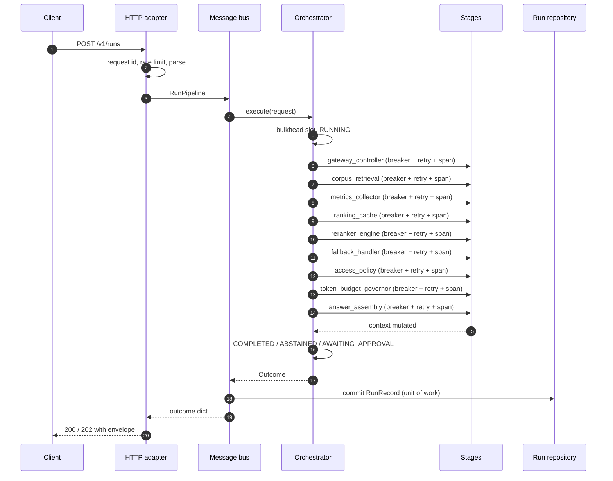

# Request sequence

```mermaid
sequenceDiagram
    autonumber
    participant C as Client
    participant H as HTTP adapter
    participant B as Message bus
    participant O as Orchestrator
    participant S as Stages
    participant R as Run repository
    C->>H: POST /v1/runs
    H->>H: request id, rate limit, parse
    H->>B: RunPipeline
    B->>O: execute(request)
    O->>O: bulkhead slot, RUNNING
    O->>S: gateway_controller (breaker + retry + span)
    O->>S: corpus_retrieval (breaker + retry + span)
    O->>S: metrics_collector (breaker + retry + span)
    O->>S: ranking_cache (breaker + retry + span)
    O->>S: reranker_engine (breaker + retry + span)
    O->>S: fallback_handler (breaker + retry + span)
    O->>S: access_policy (breaker + retry + span)
    O->>S: token_budget_governor (breaker + retry + span)
    O->>S: answer_assembly (breaker + retry + span)
    S-->>O: context mutated
    O->>O: COMPLETED / ABSTAINED / AWAITING_APPROVAL
    O-->>B: Outcome
    B->>R: commit RunRecord (unit of work)
    B-->>H: outcome dict
    H-->>C: 200 / 202 with envelope
```
